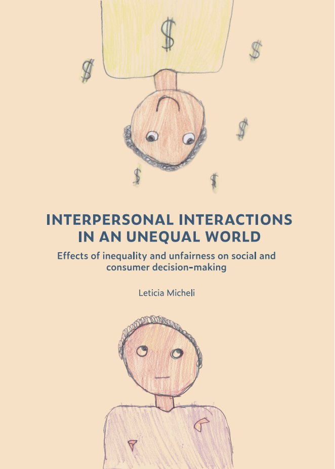

```{r setup, include=FALSE}
knitr::opts_chunk$set(echo = FALSE)
```

<div style="text-align: justify"> Growing up in a very unequal country like Brazil, I was always confronted with the enormous differences between the things I owned and the opportunities my parents could afford me and the way children in the slums (just a few blocks away from where I lived) were growing up. When I later migrated to Europe to pursue my masters degree, I was exposed to a whole new world and I was amazed to see how everything worked so differently: the sense of security people had walking down the street, how much a work-life balance was valued, how differently people consumed and used status goods and so on. It may well be this was just my own perception, but the experience of living abroad in less unequal countries definitely informed my understanding on how inequality might shape the way we live, think and behave.

During my PhD, I had the chance to turn some of my own perceptions and experiences into research questions. Specifically, I wanted to investigate the impact of inequality and unfairness on decisions made in the context of social interactions. Using a multi-method approach, I investigated how people perceive different sources of inequality of opportunity, how having more or less opportunities influence people's preferences for redistribution, the effect of perceptions of economic mobility on status consumption and the neural mechanisms associated with the enforcement of fairness norms. If you are interested in learning more about the research I did during my PhD, you can find below the link to my thesis and the video of my defense. </div>

<br>

```{r, echo=FALSE, fig.align='center', out.width = "55%"}

#fig.width=2.5
```

<center>

[ [University Repository](https://cris.maastrichtuniversity.nl/en/publications/interpersonal-interactions-in-an-unequal-world-effects-of-inequal)]

<br>

```{r, eval=knitr::is_html_output(excludes = "epub"), results = 'asis', echo = F}
cat(
'<iframe width="600" height="400" 
  src="https://www.youtube.com/embed/pfdd8ny9VJ8"
  frameborder="0" allow="accelerometer; autoplay; encrypted-media;
  gyroscope; picture-in-picture" allowfullscreen>
  </iframe>'
)
```

<div style="text-align: justify"> The whole PhD journey made me reflect several times on the way things were back home. So, when it was time to wrap up the thesis, I felt it would not be complete without representing inequality through the eyes of those most affected by it. I then reached out to an association in Brazil who tends to underprivileged children living in the slums (the one close to where I grew up). Together with the children, they developed a class assignment where children drew what inequality means to them. The results of this activity were these beautiful and touching drawings below, which I included (with their permission) in my thesis as illustrations. </div>


<br>

```{r, echo=FALSE, fig.align='center'}
library(pixture)
pixgallery(list.files("images", full.names=TRUE), 
           dim = "200px", gap = "10px", type = "grid")
```

<div style="text-align: justify"> What I admire so much about this association is that it offers children opportunities they wouldn't otherwise have access to, given their families socioeconomic background. The children who are assisted visit this association daily, and are offered educational support, English, music and computer classes, psychological assistance and meals. With the help of my family, friends, colleagues and the wonderful academic community on Twitter, we were able to raise some funds, which were used to provide these kids with a Christmas celebration and brand new school materials for the academic year of 2022. You can see pictures of their Christmas celebration below (shared with their permission). 

Thank you so much to everyone who helped! And if you would still like to help out this association, you can always do so through this page [here](https://vaka.me/797002), which is a reliable Brazilian crowdfunding page. I am sure your help will be very much appreciated!

<br>

```{r, echo=FALSE, fig.align='center'}
library(pixture)
pixgallery(list.files("img", full.names=TRUE), 
           dim = "200px", gap = "6px", type = "grid")
```
